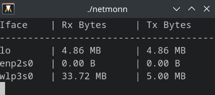

# NetMonN

NetMonN is a terminal-based tool to monitor real-time network usage on Linux.

It displays received and transmitted bytes for each network interface, updating every second.

## Usage

1. **Build:**  
   ```sh
   make
   ```

2. **Run:**  
   ```sh
   ./netmonn
   ```

## Screenshot


